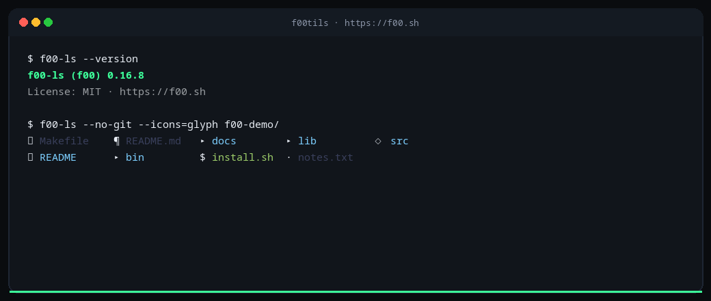
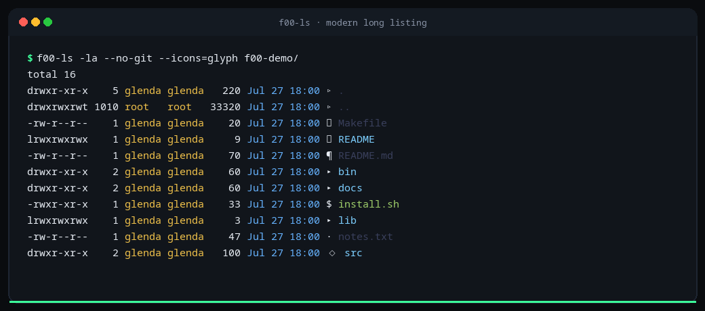
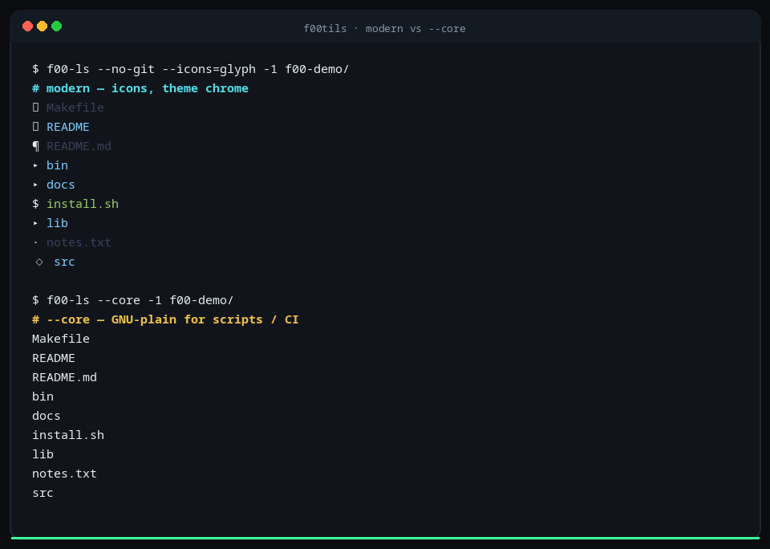
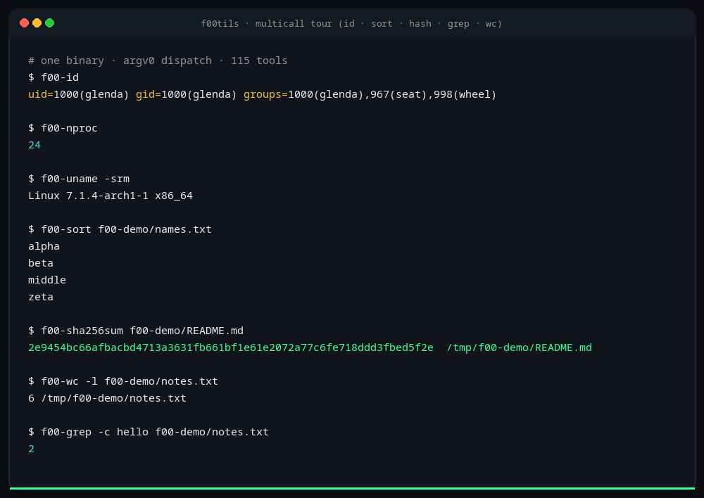

# f00tils

**f00tils** is the freestanding assembly **GNU userland** (coreutils + grep + findutils + diffutils).

Binary name: **`f00`**. Tool names: **`f00-*`**. Joke: coreutils → **f00tils**.

One multicall x86-64 Linux binary (no libc). Modern defaults for interactive work. `--core` for scripts. **Four GNU packages** (coreutils · grep · findutils · diffutils — 115 tools) with **per-package** suite totals (never one blended average). MIT.

| | |
|---|---|
| **Project** | **f00tils** — GNU **userland** replacement (4 packages) |
| **Packages** | **coreutils** (106) · **grep** (3) · **findutils** (2) · **diffutils** (4) = **115** |
| **Binary** | `f00` = **config hub/TUI**; `f00-*` tools; bare names via PATH replace |
| **Default** | Modern (color, **Nerd File Icons**, table columns, chromed JSON/CSV) |
| **Icons** | On by default (Nerd; ascii fallback if no font) · `emoji`/`glyph`/`ascii` skins · off under `--core` |
| **Scripts** | `--core` — byte-identical to the GNU tool |
| **Engine** | Pure ASM multicall · ~650K static · no libc |
| **License** | MIT |
| **Status** | Released `v0.16.3` |
| **Site** | [https://f00.sh](https://f00.sh) |
| **Repo** | [github.com/theesfeld/f00](https://github.com/theesfeld/f00) |

```bash
curl -fsSL https://f00.sh/install.sh | bash
```

<p align="center">
  
</p>

<p align="center">
  
</p>

---

## Why it matters

GNU userland is correct and portable. It is not the speed or UX ceiling.

**f00tils** ships **four** GNU package sets as one freestanding multicall: coreutils, grep, findutils, and diffutils. You keep script-safe **`--core`** (byte-identical + faster wall/CPU), and modern presentation by default.

---

## Product laws

1. **Clone first (`--core`).** Covered GNU tools (coreutils, grep, findutils, diffutils) have `f00-*` names. Under **`--core`**, output is **byte-identical** to GNU for the same inputs (stdout/stderr + exit code) — scripts must not care which binary ran.
2. **`--core` must win on resources.** The core path must beat GNU on **wall time and CPU** (user+sys). Correct but slower is unfinished. Wall and CPU are **separate** averages — never blended; no RSS theater.
3. **Modern is amazing (default).** Non-`--core` is not a pale GNU subset: theme tokens, chrome, icons, rich `--json`/`--csv`, and extra power (fd/rg/delta-class where it fits). Output may differ freely from GNU. Scripts stay on `--core`; humans get the good mode.
4. **One binary.** Multicall by `argv0` (`f00-ls`, `ls`, `f00-grep`, `grep`, …).

---

## Feature parity

| Area | GNU | **f00tils (ASM)** | uutils | busybox / toybox |
|------|-----|-------------------|--------|------------------|
| coreutils names | Yes | **106/106** | Growing | Subset |
| grep / findutils / diffutils | Separate pkgs | **9/9 shipped** (depth varies) | Partial | Subset |
| Script drop-in | Yes | **`--core`** | Flags vary | Reduced |
| Modern default UX | No | **Yes** | Partial | Minimal |
| Suite-wide `--json`/`--csv` | No | **Yes (`f00/v1`)** | Limited | No |
| Pure freestanding ASM | No | **Yes** | No | C |
| Multicall single binary | No* | **Yes** | Optional | Yes |

\*GNU ships many separate binaries across packages.

### Suite modern surface

| Capability | Default (modern) | `--core` |
|------------|------------------|----------|
| Color / theme chrome | **On** TTY (respects `NO_COLOR`) | Off |
| Extra UX / features | **Yes** — best interactive experience | Minimal; script-safe only |
| `--json` / `--csv` | Rich `f00/v1` where applicable | Available, plain |
| Wall + CPU vs GNU | Should feel instant | **Must beat GNU wall and CPU** (separate metrics) |

---

## Config & settings

Bare **`f00`** is the config hub/TUI (Themes · Settings · Plugins) → `~/.config/f00/config`.

| Setting | Effect |
|---------|--------|
| `replace` | Bare names on PATH run f00tils (**install default on**) |
| `core` | Prefer GNU-plain presentation suite-wide |
| `theme` | Named theme (truecolor / terminal / f00) |
| `color` | auto / always / never |
| `icons` | nerd / ascii / off |
| animations / spinner | Motion on long work |
| git / hyperlink / dirs-first / ignore-files | Modern **ls** |
| headers / line-numbers / syntax | Modern **cat** |

```bash
f00                       # TUI
f00-config                # CLI
f00-config replace off    # keep GNU bare names
```

---

## Package map (115 tools)

| GNU package | Count | Shipped | `--core` depth | Scoreboard |
|-------------|------:|--------:|:---------------|:-----------|
| **coreutils** | 106 | 106/106 | full (common cases) | [COREUTILS-PROGRESS.md](docs/COREUTILS-PROGRESS.md) |
| **grep** | 3 | 3/3 | full common | [GNU-USERLAND-PROGRESS.md](docs/GNU-USERLAND-PROGRESS.md) |
| **findutils** | 2 | 2/2 | partial | same |
| **diffutils** | 4 | 4/4 | 1 full · 3 partial | same |
| **Total** | **115** | **115/115** | mixed | website tabs |

Also multicall extras: `config`, `hostname`, `kill`, `rev`, … (~119 argv0 names).

---

## Coreutils replacement progress

**Goal: replace every GNU coreutils program** (one of four package sets).

<!-- progress: total=106 shipped=106 core_full=106 core_partial=0 core_missing=0 -->
**Progress:** **106/106** tools shipped · **`--core` depth:** 106 full · 0 partial · 0 missing

| Status | Count | Meaning |
|--------|------:|---------|
| shipped | 106/106 | Multicall name exists as `f00-*` |
| `--core` **full** | 106 | Tracked flags match for common cases |
| `--core` partial | 0 | Tool works; some GNU flags still deepening |
| `--core` **missing** | 0 | Not yet in multicall |

Legend — **speed:** `win` = faster than coreutils under `--core`. `—` = not shipped.

| # | coreutils | f00 | shipped | `--core` depth | modern | speed vs GNU |
|--:|:----------|:----|:--------|:---------------|:-------|:-------------|
| 1 | `arch` | `f00-arch` | yes | **full** | yes | win |
| 2 | `b2sum` | `f00-b2sum` | yes | **full** | yes | win |
| 3 | `base32` | `f00-base32` | yes | **full** | yes | win |
| 4 | `base64` | `f00-base64` | yes | **full** | yes | win |
| 5 | `basename` | `f00-basename` | yes | **full** | yes | win |
| 6 | `basenc` | `f00-basenc` | yes | **full** | yes | win |
| 7 | `cat` | `f00-cat` | yes | **full** | deep | win |
| 8 | `chcon` | `f00-chcon` | yes | **full** | yes | win |
| 9 | `chgrp` | `f00-chgrp` | yes | **full** | yes | win |
| 10 | `chmod` | `f00-chmod` | yes | **full** | yes | win |
| 11 | `chown` | `f00-chown` | yes | **full** | yes | win |
| 12 | `chroot` | `f00-chroot` | yes | **full** | yes | win |
| 13 | `cksum` | `f00-cksum` | yes | **full** | yes | win |
| 14 | `comm` | `f00-comm` | yes | **full** | yes | win |
| 15 | `cp` | `f00-cp` | yes | **full** | yes | win |
| 16 | `csplit` | `f00-csplit` | yes | **full** | yes | win |
| 17 | `cut` | `f00-cut` | yes | **full** | yes | win |
| 18 | `date` | `f00-date` | yes | **full** | yes | win |
| 19 | `dd` | `f00-dd` | yes | **full** | yes | win |
| 20 | `df` | `f00-df` | yes | **full** | yes | win |
| 21 | `dir` | `f00-dir` | yes | **full** | yes | win |
| 22 | `dircolors` | `f00-dircolors` | yes | **full** | yes | win |
| 23 | `dirname` | `f00-dirname` | yes | **full** | yes | win |
| 24 | `du` | `f00-du` | yes | **full** | yes | win |
| 25 | `echo` | `f00-echo` | yes | **full** | yes | win |
| 26 | `env` | `f00-env` | yes | **full** | yes | win |
| 27 | `expand` | `f00-expand` | yes | **full** | yes | win |
| 28 | `expr` | `f00-expr` | yes | **full** | yes | win |
| 29 | `factor` | `f00-factor` | yes | **full** | yes | win |
| 30 | `false` | `f00-false` | yes | **full** | yes | win |
| 31 | `fmt` | `f00-fmt` | yes | **full** | yes | win |
| 32 | `fold` | `f00-fold` | yes | **full** | yes | win |
| 33 | `groups` | `f00-groups` | yes | **full** | yes | win |
| 34 | `head` | `f00-head` | yes | **full** | yes | win |
| 35 | `hostid` | `f00-hostid` | yes | **full** | yes | win |
| 36 | `id` | `f00-id` | yes | **full** | yes | win |
| 37 | `install` | `f00-install` | yes | **full** | yes | win |
| 38 | `join` | `f00-join` | yes | **full** | yes | win |
| 39 | `link` | `f00-link` | yes | **full** | yes | win |
| 40 | `ln` | `f00-ln` | yes | **full** | yes | win |
| 41 | `logname` | `f00-logname` | yes | **full** | yes | win |
| 42 | `ls` | `f00-ls` | yes | **full** | deep | win |
| 43 | `md5sum` | `f00-md5sum` | yes | **full** | yes | win |
| 44 | `mkdir` | `f00-mkdir` | yes | **full** | yes | win |
| 45 | `mkfifo` | `f00-mkfifo` | yes | **full** | yes | win |
| 46 | `mknod` | `f00-mknod` | yes | **full** | yes | win |
| 47 | `mktemp` | `f00-mktemp` | yes | **full** | yes | win |
| 48 | `mv` | `f00-mv` | yes | **full** | yes | win |
| 49 | `nice` | `f00-nice` | yes | **full** | yes | win |
| 50 | `nl` | `f00-nl` | yes | **full** | yes | win |
| 51 | `nohup` | `f00-nohup` | yes | **full** | yes | win |
| 52 | `nproc` | `f00-nproc` | yes | **full** | yes | win |
| 53 | `numfmt` | `f00-numfmt` | yes | **full** | yes | win |
| 54 | `od` | `f00-od` | yes | **full** | yes | win |
| 55 | `paste` | `f00-paste` | yes | **full** | yes | win |
| 56 | `pathchk` | `f00-pathchk` | yes | **full** | yes | win |
| 57 | `pinky` | `f00-pinky` | yes | **full** | yes | win |
| 58 | `pr` | `f00-pr` | yes | **full** | yes | win |
| 59 | `printenv` | `f00-printenv` | yes | **full** | yes | win |
| 60 | `printf` | `f00-printf` | yes | **full** | yes | win |
| 61 | `ptx` | `f00-ptx` | yes | **full** | yes | win |
| 62 | `pwd` | `f00-pwd` | yes | **full** | yes | win |
| 63 | `readlink` | `f00-readlink` | yes | **full** | yes | win |
| 64 | `realpath` | `f00-realpath` | yes | **full** | yes | win |
| 65 | `rm` | `f00-rm` | yes | **full** | yes | win |
| 66 | `rmdir` | `f00-rmdir` | yes | **full** | yes | win |
| 67 | `runcon` | `f00-runcon` | yes | **full** | yes | win |
| 68 | `seq` | `f00-seq` | yes | **full** | yes | win |
| 69 | `sha1sum` | `f00-sha1sum` | yes | **full** | yes | win |
| 70 | `sha224sum` | `f00-sha224sum` | yes | **full** | yes | win |
| 71 | `sha256sum` | `f00-sha256sum` | yes | **full** | yes | win |
| 72 | `sha384sum` | `f00-sha384sum` | yes | **full** | yes | win |
| 73 | `sha512sum` | `f00-sha512sum` | yes | **full** | yes | win |
| 74 | `shred` | `f00-shred` | yes | **full** | yes | win |
| 75 | `shuf` | `f00-shuf` | yes | **full** | yes | win |
| 76 | `sleep` | `f00-sleep` | yes | **full** | yes | win |
| 77 | `sort` | `f00-sort` | yes | **full** | yes | win |
| 78 | `split` | `f00-split` | yes | **full** | yes | win |
| 79 | `stat` | `f00-stat` | yes | **full** | yes | win |
| 80 | `stdbuf` | `f00-stdbuf` | yes | **full** | yes | win |
| 81 | `stty` | `f00-stty` | yes | **full** | yes | win |
| 82 | `sum` | `f00-sum` | yes | **full** | yes | win |
| 83 | `sync` | `f00-sync` | yes | **full** | yes | win |
| 84 | `tac` | `f00-tac` | yes | **full** | yes | win |
| 85 | `tail` | `f00-tail` | yes | **full** | yes | win |
| 86 | `tee` | `f00-tee` | yes | **full** | yes | win |
| 87 | `test` | `f00-test` | yes | **full** | yes | win |
| 88 | `timeout` | `f00-timeout` | yes | **full** | yes | win |
| 89 | `touch` | `f00-touch` | yes | **full** | yes | win |
| 90 | `tr` | `f00-tr` | yes | **full** | yes | win |
| 91 | `true` | `f00-true` | yes | **full** | yes | win |
| 92 | `truncate` | `f00-truncate` | yes | **full** | yes | win |
| 93 | `tsort` | `f00-tsort` | yes | **full** | yes | win |
| 94 | `tty` | `f00-tty` | yes | **full** | yes | win |
| 95 | `uname` | `f00-uname` | yes | **full** | yes | win |
| 96 | `unexpand` | `f00-unexpand` | yes | **full** | yes | win |
| 97 | `uniq` | `f00-uniq` | yes | **full** | yes | win |
| 98 | `unlink` | `f00-unlink` | yes | **full** | yes | win |
| 99 | `uptime` | `f00-uptime` | yes | **full** | yes | win |
| 100 | `users` | `f00-users` | yes | **full** | yes | win |
| 101 | `vdir` | `f00-vdir` | yes | **full** | yes | win |
| 102 | `wc` | `f00-wc` | yes | **full** | yes | win |
| 103 | `who` | `f00-who` | yes | **full** | yes | win |
| 104 | `whoami` | `f00-whoami` | yes | **full** | yes | win |
| 105 | `yes` | `f00-yes` | yes | **full** | yes | win |
| 106 | `[` | `f00-[ / test` | yes | **full** | yes | win |

Also shipped (useful multicall extras): `f00-hostname`, `f00-kill`, `f00-rev`.

Detail: [docs/GNU-COMPLIANCE.md](docs/GNU-COMPLIANCE.md) · scoreboard: [docs/COREUTILS-PROGRESS.md](docs/COREUTILS-PROGRESS.md)

---


## GNU userland (grep · findutils · diffutils)

Same dual-track law as coreutils (`--core` byte-identical + faster wall/CPU; modern amazing).

**Scoreboard:** [docs/GNU-USERLAND-PROGRESS.md](docs/GNU-USERLAND-PROGRESS.md) · **9/9 shipped** · **4 full / 5 partial** (depth still crushing).

### grep

| # | GNU | f00 | shipped | `--core` | modern | Notes |
|--:|:----|:----|:--------|:---------|:-------|:------|
| 1 | `grep` | `f00-grep` | yes | **full** | deep | Common flags; no `-A/-B/-C`/PCRE yet |
| 2 | `egrep` | `f00-egrep` | yes | **full** | yes | ≡ `grep -E` |
| 3 | `fgrep` | `f00-fgrep` | yes | **full** | yes | ≡ `grep -F` |

### findutils

| # | GNU | f00 | shipped | `--core` | modern | Notes |
|--:|:----|:----|:--------|:---------|:-------|:------|
| 1 | `find` | `f00-find` | yes | **partial** | deep | `-name/-path/-type/-maxdepth/-mindepth`; more predicates TBD |
| 2 | `xargs` | `f00-xargs` | yes | **partial** | yes | `-n/-0/-r`; quoting/ARG_MAX TBD |

### diffutils

| # | GNU | f00 | shipped | `--core` | modern | Notes |
|--:|:----|:----|:--------|:---------|:-------|:------|
| 1 | `diff` | `f00-diff` | yes | **partial** | deep | LCS unified; mtime headers TBD |
| 2 | `cmp` | `f00-cmp` | yes | **full** | yes | mmap + qword |
| 3 | `diff3` | `f00-diff3` | yes | **partial** | yes | 3-way + `-m` |
| 4 | `sdiff` | `f00-sdiff` | yes | **partial** | deep | Side-by-side themed |

## Benchmarks

**Per package set — wall and CPU are separate geos (never one 115-tool blend, never wall+CPU soup).**

<!-- bench-headline:start -->
**GNU coreutils:** wall 2.6× · CPU 2.8× (86/89 wall wins · 87/89 CPU wins) · **GNU grep:** wall 9× · CPU 10.1× (3/3 wall wins · 3/3 CPU wins) · **GNU findutils:** wall 3.6× · CPU 3.7× (2/2 wall wins · 2/2 CPU wins) · **GNU diffutils:** wall 2× · CPU 2.1× (4/4 wall wins · 4/4 CPU wins)
<!-- bench-headline:end -->

Warm cache, **spawn-inclusive** wall · **children rusage** CPU · median of N runs. `f00-* --core` vs `/usr/bin/*` on Linux x86-64.

| View | Where |
|------|--------|
| Package averages + race bars by set | [f00.sh/#benchmarks](https://f00.sh/#benchmarks) |
| Full per-tool scoreboard (tabs) | [f00.sh/#scoreboard](https://f00.sh/#scoreboard) |
| Full markdown tables | [site/bench/suite.md](site/bench/suite.md) |
| Machine JSON | [site/bench/suite.json](site/bench/suite.json) |

Representative snapshot (CI overwrites; **not** the full suite — see `suite.md` for every timed tool):

<!-- bench-table:start -->
_CI / suite bench · `2026-07-24T18:27:34Z` · N=5 median · x86_64 · Linux 7.1.4-arch1-1_ · **totals are per package set, not blended**

| Package | Tool | Command | GNU wall | f00 wall | Speed | CPU × |
|---------|------|---------|---------:|---------:|------:|------:|
| coreutils | `true` | `f00-true --core` | 0.22 ms | **0.08 ms** | **~2.7×** | **~2.8×** |
| coreutils | `basename` | `f00-basename --core /usr/bin/ls` | 0.22 ms | **0.09 ms** | **~2.4×** | **~2.8×** |
| coreutils | `nproc` | `f00-nproc --core` | 0.40 ms | **0.08 ms** | **~4.8×** | **~6.1×** |
| coreutils | `whoami` | `f00-whoami --core` | 1.25 ms | **0.08 ms** | **~15.7×** | **~18.6×** |
| coreutils | `cat` | `f00-cat --core fixture.txt` | 0.23 ms | **0.10 ms** | **~2.2×** | **~2.6×** |
| coreutils | `wc` | `f00-wc --core -l fixture.txt` | 0.33 ms | **0.30 ms** | **~1.1×** | **~1.1×** |
| coreutils | `md5sum` | `f00-md5sum --core fixture.txt` | 0.88 ms | **0.20 ms** | **~4.4×** | **~4.4×** |
| coreutils | `sha256sum` | `f00-sha256sum --core fixture.txt` | 0.83 ms | **0.25 ms** | **~3.3×** | **~2.9×** |
| coreutils | `sort` | `f00-sort --core fixture.txt` | 0.65 ms | **0.53 ms** | **~1.2×** | **~1.2×** |
| coreutils | `ls` | `f00-ls --core -1 dir` | 0.28 ms | **0.21 ms** | **~1.4×** | **~1.4×** |
| grep | `grep` | `f00-grep --core -F hello fixture.txt` | 1.29 ms | **0.16 ms** | **~7.9×** | **~9.2×** |
| findutils | `find` | `f00-find --core -maxdepth 1 -name '*.txt' /tmp/f00-suite-bench.4qer4dic/dir` | 1.38 ms | **0.21 ms** | **~6.6×** | **~7.3×** |
| diffutils | `diff` | `f00-diff --core -u a.txt b.txt` | 0.39 ms | **0.33 ms** | **~1.2×** | **~1.1×** |
| diffutils | `cmp` | `f00-cmp --core fixture.txt fixture.txt` | 0.26 ms | **0.17 ms** | **~1.5×** | **~1.6×** |
<!-- bench-table:end -->

Reproduce:

```bash
cd asm && make
N=25 python3 ../scripts/gen-suite-bench.py   # writes site/bench/* + README table
make speed
bash benches/parity.sh
```

---

## Install

### One-liner (recommended)

```bash
curl -fsSL https://f00.sh/install.sh | bash
```

**Default is replace for the full tool surface.** Installs multicall `f00`, every `f00-*` in `TOOLS_ALL` (**coreutils + grep + egrep + fgrep + find + xargs + diff + cmp + diff3 + sdiff + hub extras**), and **bare names** for each (`ls`, `cat`, `grep`, `find`, `diff`, …). GNU packages stay on disk; f00 wins on **PATH**. This is not a partial alias list — `F00_TOOLS=all` is the default.

| Method | What you get | Bare names? |
|--------|----------------|-------------|
| **curl** (default) | `f00` + all `f00-*` + bare names in `~/.local/bin` | **Yes** (dir first on PATH) |
| **AUR / deb / rpm** | `f00` + `f00-*` in `/usr/bin`; bare names in `/usr/lib/f00/bin` | **Yes** via `/etc/profile.d/f00.sh` |
| **Homebrew** | `f00` + `f00-*` in `bin`; bare names in `libexec` | **Yes** after PATH / shellenv |
| curl + `F00_SUPERSEDE=0` | `f00` + `f00-*` only | No (side-by-side) |
| config `replace = false` | packages may still install bare names | **PATH snippet skips them** |

| Env / config | Effect |
|--------------|--------|
| `INSTALL_DIR` | Target bin dir (default `~/.local/bin`) |
| `F00_VERSION` | Release tag (default: latest) |
| `F00_LOCAL` | Path to local `asm/` build that contains `./f00` |
| `F00_TOOLS` | `all` (default) or comma list |
| `F00_SUPERSEDE=0` | **Opt-out:** do not install bare names (curl) |
| `replace = true` / `false` | XDG config — shell integration honors this (**default true**) |
| `f00-config replace on\|off` | Persist `replace =` |
| `F00_MAN=1` | Install man pages (default on) |

```bash
# pin version
curl -fsSL https://f00.sh/install.sh | F00_VERSION=v0.16.3 bash

# local build
curl -fsSL https://f00.sh/install.sh | F00_LOCAL=$PWD/asm bash

# side-by-side only (no bare names)
curl -fsSL https://f00.sh/install.sh | F00_SUPERSEDE=0 bash

# keep GNU bare names later
f00-config replace off    # writes replace = false; new shell
```

Config (`~/.config/f00/config`): presentation (theme, color, icons, `--core`) **and** `replace` for PATH takeover. Packages never overwrite `/usr/bin/cat` files (no distro package conflicts).

**Platform:** Linux x86-64 release assets. Build from source on other hosts is not the product path yet.

### From source

```bash
git clone https://github.com/theesfeld/f00.git
cd f00/asm
make
make smoke
make install
```

Requires: `nasm`, `ld` (binutils). Target: **Linux x86-64**.

---

## Package managers

Release assets for `v0.16.3` include tarball, **deb**, **rpm**, and **Arch** packages.

| Channel | Status | Notes |
|---------|--------|-------|
| **Install script** | Primary | `curl -fsSL https://f00.sh/install.sh \| bash` |
| **GitHub Releases** | Shipped | `.tar.gz`, `.deb`, `.rpm`, `.pkg.tar.zst` |
| **Homebrew** | Formula | `Formula/f00.rb` → `brew install theesfeld/tap/f00` (Linux bottle from release tarball) |
| **AUR** | PKGBUILD | `packaging/aur/PKGBUILD` (build from tag) |
| **Debian / Ubuntu** | `.deb` asset | `sudo dpkg -i f00_*_amd64.deb` |
| **Fedora / RHEL** | `.rpm` asset | `sudo rpm -Uvh f00-*.x86_64.rpm` |
| **Arch (local)** | `.pkg.tar.zst` asset | `sudo pacman -U f00-*-x86_64.pkg.tar.zst` |
| **Nix** | Experimental | `flake.nix` (x86_64-linux) |

```bash
# Debian / Ubuntu example
curl -fsSLO https://github.com/theesfeld/f00/releases/download/v0.16.3/f00_0.16.3_amd64.deb
sudo dpkg -i f00_0.16.3_amd64.deb

# Fedora / RHEL example
curl -fsSLO https://github.com/theesfeld/f00/releases/download/v0.16.3/f00-0.16.3-1.x86_64.rpm
sudo rpm -Uvh f00-0.16.3-1.x86_64.rpm

# Arch example (release package)
curl -fsSLO https://github.com/theesfeld/f00/releases/download/v0.16.3/f00-0.16.3-1-x86_64.pkg.tar.zst
sudo pacman -U f00-0.16.3-1-x86_64.pkg.tar.zst
```

---

## Quick start

```bash
f00-ls -la
f00-ls --core -la
f00-cat -n README.md
f00-wc --json Makefile
f00-sha256sum --core file
f00-grep -F hello README.md
f00-find . -maxdepth 1 -name '*.md'
f00-diff -u a b
f00-cmp a b
f00                  # config TUI
f00 --list-utils
```

### Screenshots (color)

Color terminal captures from the multicall suite (`f00` / `f00-*`).

| | |
|---|---|
| **f00-ls -la** |  |
| **modern vs --core** |  |
| **suite tools** |  |

Regenerate brand assets and screenshots:

```bash
cd asm && make
python3 ../scripts/render-brand-assets.py
```

---

## Layout

```
asm/                 pure assembly product (canonical)
  src/ls/            multicall sources + suite_*.asm modules
  man/man1/          f00(1) + f00-*(1)
  benches/           speed-gate, parity, smoke
site/                f00.sh (GitHub Pages) + install.sh + bench data
docs/                compliance, UX, modern features, scoreboard
file_id.diz          ACiD / 16colo.rs-style release scene card
packaging/           AUR + nfpm (deb/rpm/arch)
Formula/             Homebrew
scripts/             package and bench generators
install.sh           curl installer
```

---

## Current gaps (honest)

| Area | Gap |
|------|-----|
| **find** | More predicates (`-regex`, `-exec`, …) still partial |
| **xargs** | Quoting / ARG_MAX edge cases |
| **diff / diff3 / sdiff** | Full GNU formats (mtime headers, all flags) incomplete |
| **grep** | No `-A/-B/-C` context yet; no PCRE; multi-MB emit still optimizing |
| **Bench coverage** | ~90/106 coreutils have safe timed races; destructive/privileged tools use light entry races or scoreboard-only |
| **Modern depth** | fd/rg/delta-class extras vary by tool — some deep, some still rising |
| **Platform** | Product path is **Linux x86-64** release assets |

Depth scoreboard: [GNU-USERLAND-PROGRESS.md](docs/GNU-USERLAND-PROGRESS.md) · flags: [GNU-COMPLIANCE.md](docs/GNU-COMPLIANCE.md).

## Documentation

| Doc | Topic |
|-----|-------|
| [docs/COREUTILS-PROGRESS.md](docs/COREUTILS-PROGRESS.md) | Scoreboard for every coreutil |
| [docs/GNU-USERLAND-PROGRESS.md](docs/GNU-USERLAND-PROGRESS.md) | grep · findutils · diffutils |
| [docs/GNU-COMPLIANCE.md](docs/GNU-COMPLIANCE.md) | Per-flag full / partial / missing |
| [docs/TERMINAL-UX.md](docs/TERMINAL-UX.md) | Color tokens, help, JSON envelope |
| [docs/MODERN-FEATURES.md](docs/MODERN-FEATURES.md) | Modern extras |
| [CHANGELOG.md](CHANGELOG.md) | Releases |
| [file_id.diz](file_id.diz) | Release scene card (GitHub asset; not site-spotlighted) |
| Man | `man f00` · `man f00-ls` · `man f00-cat` · … |

## Scene card

Each SemVer release ships a crafted [`file_id.diz`](file_id.diz) scene card (block/high-ASCII,
ACiD / [16colo.rs](https://16colo.rs/) energy) next to the changelog. GitHub Releases attach the
same file as an asset. Keep monospaced when you view it.

```text
░▒▓████████████████████████████████████████████▓▒░░░
█▓▒░  f 0 0 t i l s  ·  scene card  ·  v0.16.3 ░▒▓█ 
████████████████████████████████████████████████████
█  ▄████████▄   ▄███████▄   ▄███████▄              █
█  ███▀▀▀▀███   ███▀▀▀▀███  ███▀▀▀▀███  freest.    █
█  ███        ▄ ███     ███ ███     ███  ASM       █
█  ████████   █ ███     ███ ███     ███  suite     █
█  ███        █ ███     ███ ███     ███  multi     █
█  ███        █ ███▄▄▄▄███  ███▄▄▄▄███  call       █
█  ▀          ▀  ▀██████▀    ▀██████▀   f00-*      █
████████████████████████████████████████████████████
█  MIT · 2026-07-24 · 115 tools · 4 GNU packages  █
█  modern default · --core for scripts             █
█  coreutils · grep · findutils · diffutils        █
█  coreutils 2.6× · per-set totals (not blended)   █
█  core 2.6× · grep 9× · find 3.6× · diff 2×       █
█  https://f00.sh · github:theesfeld/f00           █
████████████████████████████████████████████████████
  ░▒▓  no libc · Linux x86-64 · curl | bash  ▓▒░    
```

---

## Build and quality gates

```bash
cd asm
make
make smoke
make speed
make ux-check
```

---

## License

MIT — see [LICENSE](LICENSE).
